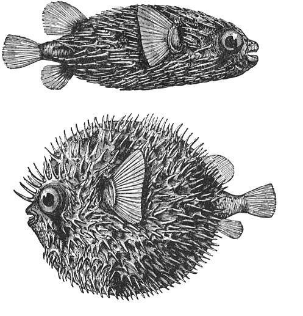

# Yassin Achengli

Blog personal de [Yassin Achengli](https://yassinachengli.com) — ingeniero de telecomunicaciones, friki de las matemáticas y filósofo, y muchas cosas más.

🌐 [yassinachengli.com](https://yassinachengli.com) · ℹ️ [Sobre mí](https://yassinachengli.com/about/)



## Sobre mí

¡Hola! Soy Yassin, ingeniero de telecomunicaciones, friki de las matemáticas y filósofo, y muchas cosas más.

Soy muy curioso, sobre todo cuando se refiere a temas científicos, medio ambiente y en general, el conocimiento, por eso es que he decidido crear este blog, para publicar cosas que me parece que son interesantes, útiles y motivadoras para quien lea esto.

Cómo puedes observar, este blog se organiza en tópicos que pueden no ser los mismos en el futuro, quiero decir que es posible que vaya a crear nuevos tópicos acerca de nuevos intereses que necesitan su propio foco.

## Acerca del blog

Hice este blog usando el generador de sitios estáticos [Astro](https://astro.build/), partiendo de la plantilla [AstroPaper](https://github.com/satnaing/astro-paper). Astro es muy útil para personas minimalistas como yo porque no es necesario dedicar mucho esfuerzo al estilo y la estructura web, profundizando en aspectos de CSS, HTML y JavaScript. Puedes publicar directamente tus archivos en formato markdown e incluso usar secciones con **LaTeX**.

Si quieres echar un vistazo al código fuente de este sitio web, estás en el sitio correcto: el repositorio es abierto. Siéntete libre de copiar el código, editar lo que quieras y tomar inspiración si te resulta útil.

## Desarrollo local

```bash
pnpm install
pnpm dev
```

| Comando        | Acción                                      |
| :------------- | :------------------------------------------ |
| `pnpm install` | Instala dependencias                        |
| `pnpm dev`     | Arranca el servidor local en `localhost:4321` |
| `pnpm build`   | Compila el sitio                            |
| `pnpm preview` | Previsualiza el build localmente            |

## Enlaces

- Web: [yassinachengli.com](https://yassinachengli.com)
- GitHub: [achengli](https://github.com/achengli)
- LinkedIn: [Yassin Achengli](https://www.linkedin.com/in/yassin-achengli-benmouais-a3934121b)
- Email: [yassin_achengli@gmail.com](mailto:yassin_achengli@gmail.com)

Basado en [AstroPaper](https://github.com/satnaing/astro-paper) de Sat Naing.
