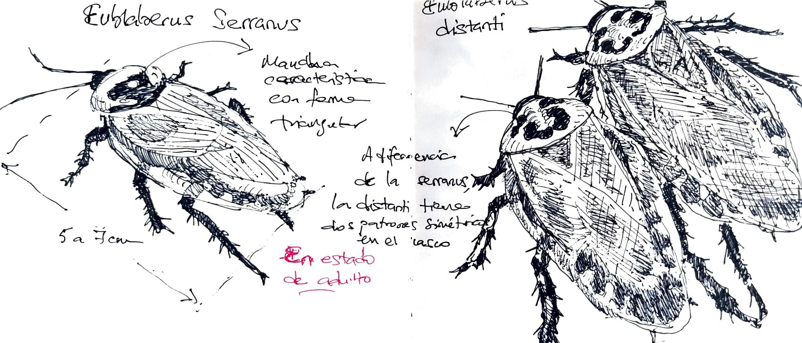
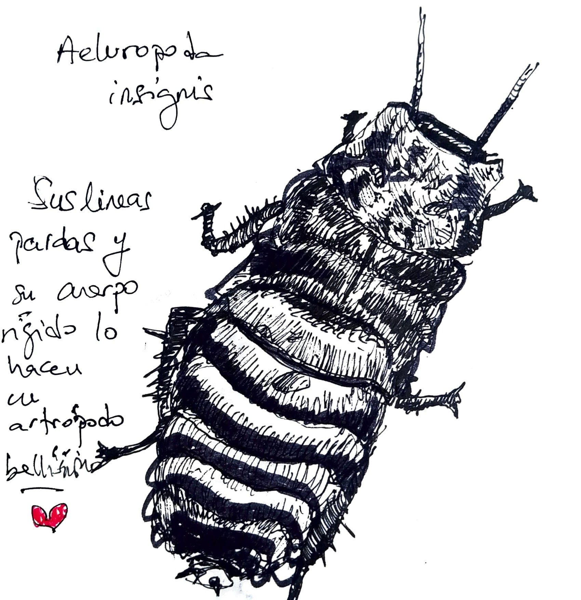
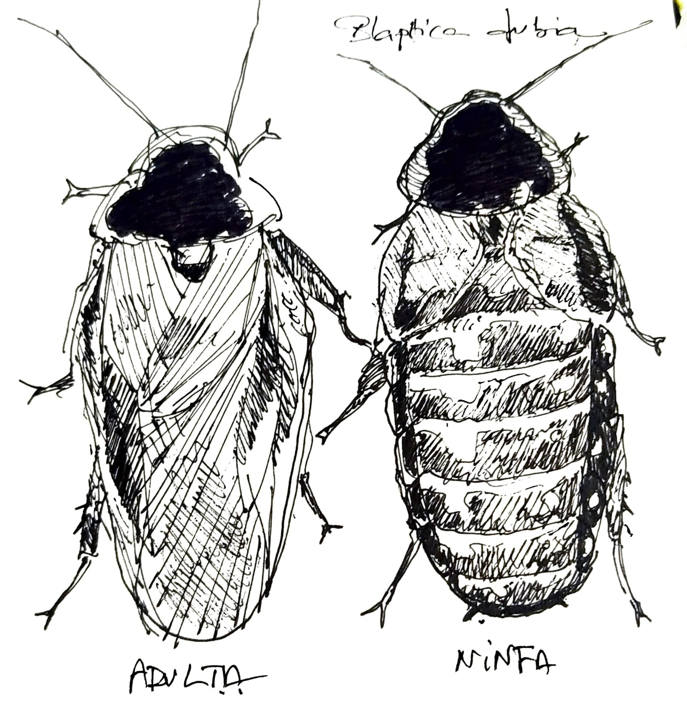
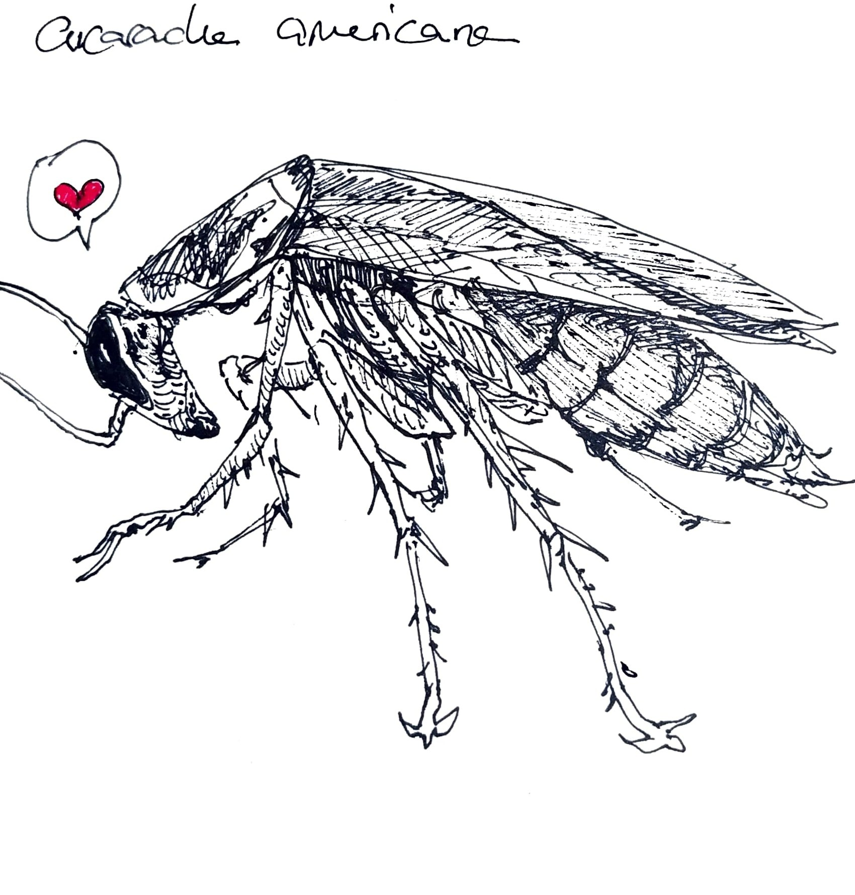

# Las cucarachas y su aplicación
---

## Las cucarachas dan miedo
---
Tenemos asociados un miedo innato a las cucarachas y es entendible. Son muy distintos a nosotros y con
su tamaño nos da miedo que nos toquen con esas pequeñas patitas afiladas y movimientos frenéticos. Los 
artrópodos por lo general suelen ser poco agradables por su diferencia genética *"Tienen muchas patas,
trepan y su exoesqueleto no es nada común en los mamíferos"*.

Yo me propuse perderles miedo y la verdad es que hay un punto muy positivo en ello. Hay ciertas especies
de cucarachas que son muy útiles desde el punto de vista de la ingeniería biológica pudiéndose aplicar
habitats de estas cucarachas con fines industriales.

Doy el ejemplo del biocompost. Debido a los residuos orgánicos. Mucho del metano y otros gases 
perjudiciales para la atmósfera son generados por la descomposición anaeróbica de estos residuos, y las
cucarachas podrían ayudarnos a descomponer estos desechos sin emitir gases perjudiciales o prácticamente
sin emitirlos, y a su vez generando un compost a base de guano de curacacha muy rico en nitratos para
cultivos, lo cual a su vez nos permite prescindir del estiercol bobino que también emite muchísimo metano.

No todas las cucarachas sirven para este tipo de uso pero si existen algunas especies que podrían servir
y que voy a presentar a continuación.

Para evitar usar imágenes propietarias y también para practicar mis habilidades de dibujo, he puesto
unas ilustraciones para mostrar cómo se ven estas cucarachas.

## El blaticompost
---
El **blaticompost** es un estilo de compostaje mediante el uso de artrópodos, anélidos o platelmintos entre
otros. Consiste en incubar los restos orgánicos en un recinto cerrado con dichos animales para que estos, 
mediante su alimentación y digestión, consiguen reducir los restos en nutrientes fértiles sin prácticamente
emitir gases perjudiciales para la atmósfera y el medioambiente.

## Eublaberus - Cucarachas de cueva
---

En primer lugar presento la *Eublaberus Serranus*, una cucaracha propia de cuevas tropicales localizadas
en América del sur.

La eublaberus serranus es una cucaracha muy apta para el compostaje de materia organica no muy rica en 
nitratos *(Puedes echarle carne pero sin pasarte demasiado)*. Su morfología hace que no sean trepadoras 
en terrarios de vidrio y tampoco vuelan, cómo las otras cucarachas que presentaré salvo la última. Al ser
lentas, dóciles y no trepar, son unas candidatas idóneas para usarlas cómo compostadoras activas.

*Ilustración de una Eublaberus Serranus y Eublaberus distanti a la derecha*

La Eublaberus se puede reconocer por su mancha en el casco; tiene una forma triangular invertida, con la
punta en dirección al abdómen. Su longitud es de unos 3 a 4 cm las ninfas, y de 5 a 7 cm las adultas.

Su habitat natural en cuevas hace que posean pocos depredadores, esto es la consecuencia por la cual no 
vuelan y es complicado que se fuguen. En las cuevas se alimentan principalmente de excrementos de 
murciélago y murciélagos muertos.

Su biota intestinal es muy diversa en microorganismos y por eso debido a 
[estudios relacionados](https://journalijecc.com/index.php/IJECC/article/view/2296) con su aplicación 
en el blaticompostaje, se ha concluido que es un gran ejemplo de uso.

Otro ejemplo es el *Eublaberus distanti*; una cucaracha muy similar pero con una capacidad algo mejorada
en la descomposición de restos ricos en nitratos cómo puede ser los restos cárnicos de un buen asado
argentino *(en un buen asado no sobra nada* 😛*)*.

## Aeluropoda insignis
---

Esta cucaracha, más allá de su aplicación, me parece bellísima. No tiene alas y se vé cómo una ninfa pero
con un caparazón algo más robusto y una cabeza que recuerda a un escarabajo rinoceronte europeo pero sin 
cuerno.

*Ilustración de la aeluropoda insignis*

Esta cucaracha es otra gran candidata para hacer blaticompost. No es mejor que las blaptica pero son muy 
bonitas de ver y creo que el blaticompost con un terrario no es solo para usarlo con fines de reciclaje
y el compost, sino también para disfrutar viendo un documental en persona.

## Blaptica dubia
---

La blaptica dubia es la gran recomendada para hacer blaticompost. Es fácil de criar ya que es muy 
resistente. Descompone más cantidad de alimento que las otras cucarachas que se han mostrado y al igual que
la eublaberus, su residuo es seco, lo que hace que cribarlo de las ninfas y larvas sea fácil y limpio.

Se parecen mucho taxonómicamente a las eublaberus, solamente que son algo más tróficas y activas que las 
antes mencionadas. A diferencia de las anteriores, se las puede diferenciar por una mancha negra que cubre 
casi la totalidad de su casco y también su tamaño es menor, pudiendo ser de unos 5 cm a máximo 6 las 
adultas.

*Ilustración de la blaptica dubia junto a su ninfa*

Cuando tenga mi propio terrario, sin lugar a dudas probaré con esta cucaracha primeramente. Su habitat
también es muy trópical y para nada invasora. Al final de las cientos de especies de cucarachas que
existen, solo 17 son invasoras.

## Periplaneta americana (cucaracha americana común)
---

Esta es una cucaracha facil de conseguir pero no se cómo rinde en la descomposición de matería orgánica
y tampoco recomiendo usarla, pues más que nada es ilegal, al menos en España tener crianza de ellas puesto
que es una especie invasora y portadora de infecciones.

La verdad es que es una cucaracha que de primeras insta al rechazo por el asco que le tenemos pero 
yo creo que por lo resistente que es, y su variedad alimentaria, podría ser un perfecto aliado en el 
compost, sin embargo no se cómo se podría aplicar de forma segura y controlada; no solo es voladora, sino
que también corre rápido la desgraciada.

*Ilustración de la cucaracha común o cucaracha americana vista de perfil*

Hace poco me enteré que están investigando si se podría aprovechar la leche de estas cucarachas 
*(si se le puede llamar leche)* para usarlo cómo complemento nutricional para deportistas debido a su
alto contenido en ciertos nutrientes. Yo no lo tomaría ni con sabor a fresa.

### Esto es todo
---

Las cucarachas me fascinan al igual que muchos otros *bichos*, dicho coloquialmente. Creo que son una
herramienta que nos ofrece la naturaleza y que con un poco de ingeniería se pueden aplicar para resolver
problemas muy importantes; ciertamente se estan usando ya para ese tipo de fines con la agricultura, para
combatir otras plagas.

