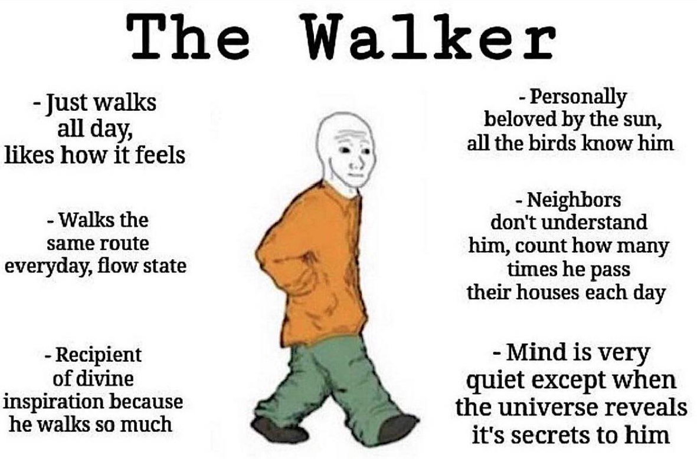

# Meditar paseando

## La filosofía del paseo
---
Cuando acudes a dar un paseo, sobre todo en aquellos paseos en solitario o con un acompañante
donde la motivación principal es el diálogo, el destino se vuelve irrelevante. Durante el
acto de pasear puedes realizar algunas cosas cómo reflexionar, escuchar algún podcast o bien
un audiolibro o albúm de música, o simplemente meditar acometido a la simpleza de cada paso.

Cuando paseas meditando, el paso rítmico se vuelve armonía, no te preocupas por cuantos pasos
has dado o cuantos kilómetros has caminado, lo único que importa es el paso y el ahora, cada
paso se observa, se siente y se disfruta de forma única, una vez lo has dado estás en otro 
paso, no hay que agarrarse al pasado.

El destino es libre, no hay destino, vas y vienes pero el propósito escapa de la localización,
más bien se encuentra en la conducta del paseo donde domina la acción de caminar y con ello
fluir. No significa forzar la pisada o ser esclavo de una pauta, se trata de ir en armonía 
con la tranquilidad de un fluir equilibrado.

## El paseo minimalista
---
El paseo minimalista es aquel que cierra el comienzo y final del paseo con un la calma de no
haber influido al trayecto, quiero decir, minimizar las alteraciones del entorno donde he 
paseado. Si voy a pasear por la costa, por ejemplo, lo único que dejaré después de mi 
presencia serán las huellas de mis pisadas en la playa.

El paseo simple no requiere más que tu voluntad de caminar, no importa la calidad de las 
zapatillas, el equipo que lleves, ni nada material del estilo, lo que vayas a necesitar lo
iras neceitando durante el continuo caminar. Deja que la voluntad del paseo haga lo que sea
más natural para el trayecto

## Pensamiento durante el paseo
---
Naturalmente surguen pensamientos y estos no deben ni ser corregidos, ni tampoco suprimidos,
simplemente continua con ellos y vívelos, de ellos puedes sacar mucha inspiración y también
ideas o asentar bien lo que se cree que ya es comprendido.

Hay muchas disciplinas distintas pero el pensamiento es de todas la más libre y sencilla de
hacer, no requiere ni papel ni boli, ni siguiera requiere que estés en tierra firme, 
el pensamiento surgue naturalmente de nuestra convicción de desarrollar las razones más 
internas que poseemos, estas estan condicionadas por nuestro repertorio de antecedentes, sin
embargo no son generadas por un estímulo externo cómo puede ser el hambre o el sueño, que si
pueden condicionarlo pero no forzarlo.

Para mi, la meditación más práctica es la que logro en estos paseos. Mientras camino 
concentrado en disfrutar del camino y sin objetivo más particular que ello, me llegan las 
mejores inspiraciones y meditaciones, muchas de ellas las quiero apuntar en papel pero en 
caso rompería el cometido del paseo.

