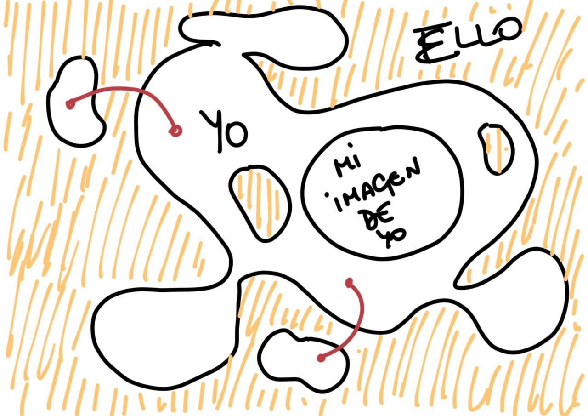

# El "Yo" y el ego
---

## ¿Quien es el "yo"?
---

Historicamente, la pregunta de quien somos ha sido de gran relevancia y es algo que nos preguntamos para tener un punto de 
partida para reconstruir nuestro entendimiento de la realidad.

Uno podría pensar que el yo es todo aquello concerniente a lo que queda dentro de tu bien material inherente, queriendo decir
con esto, nuestro cuerpo material y orgánico. Es una definición material y fundamentada en lo que creemos que somos pero sin ir
más alla de lo biológico; de otra forma también se puede entender el "yo" cómo todo lo relacionado con nuestras acciones, lo 
actuado y que forma parte de la conducta.

Definamos el yo cómo lo que es parte de nosotros, no solo aquello que es fisico, sino también lo que es conducido a ello. La
conducta de acción entendido cómo las relaciones que tenemos con el medio y con nosotros mismos. Ahora el *"yo"* es más que 
solo lo que nos atañe a nuestro ser material, es también lo que dejamos escrito, lo que queremos y la disposición de nuestros
recuerdos reflejados en ***acciones y pasiones***[^1]

[^1]: Las acciones y las pasiones definidas por la ética de Spinoza.

## El self ego
---
Yo diferencio entre dos tipos de ego, el *"****self-ego****"* y el ego. Digamos que el self-ego es el ego que uno asimila
por si mismo, es una forma de personificarse cómo un ser mejor de lo que realmente puede ser pero con la interiorización de
ello en su "yo" personal.

El ego por otro lado es el que se refleja con el resto de individuos. Si nos paramos a pensar, el ego es el realmente dañino
con nuestra salud social. Con el ego conseguimos que otros sientan rechazo y repulsión por una actitud elitísta y parece que no
pero esta bastante incrustado en nuestro ser.

Destruir nuestro ego consigue llevarnos a una nueva perspectiva de nuestro "*yo*" y el "*ello*" que nos permite calibrar lo que 
somos y lo que tenemos. Creo que es el punto de partida para construir una filosofía y de alguna manera aceptar tu conclusión
de existencia.

Ahora quiero hablar también del self-ego; este es más ajustado a nuestra propia personificación de lo que nosotros somos. 
Nuestro yo internamente tiene un nuestro yo generado que, tal y cómo se puede intuir no es idéntico a nuestro yo. Es cómo la 
[paradoja del mapa real](https://es.wikipedia.org/wiki/Paradoja_de_Bonini). Podemos entender que nuestra forma de comprender
a las personas que conocemos consiste en crear un modelo de la persona con la que nos relacionamos, un modelo que no es
exacto pero nos sirve dentro de un panorama idealizado.

Al igual que ocurre con las personas que conocemos, debemos de conocernos creando ese modelo ya dicho, el mapa de nuestro 
"yo" es la imagen de lo que somos pero sin serlo, y dentro de ello tenemos arraigados egos y creencias que son mentira.

## Cómo lograr evitar el self-ego y el ego
---
El punto más bajo de ego es no ser nada, sin embargo esto es imposible pero si nos podemos acercar; quiero decir que si 
logramos rebajar nuestos ideales a nada, conseguiremos partir de una base mínima pero sólida, a partir de ahí podemos comenzar
la reconstrucción de lo que somos, y esto se logra mediante la autoreflexión o la meditación activa. Comenzamos a hacernos 
preguntas elementales que logran hacernos responder usando nuestro mapa mental del "yo" que somos y de esta manera nuestro yo 
se reconstruye de una forma creible y real, sin mentiras logradas por nuestro miedo a la verdad.

## El ego desde mi perspectiva
---
El ego es dañino, solo te cierra puertas y te hace encerrarte en una falsa creencia de superioridad. Para mi, matar el 
ego implica matar la vergüenza, matar el miedo a que te puedan juzgar por ser tal y cómo eres. 

Para matar el ego simplemente deja de justificar tus acciones con tal de tener siempre una aprobación, permite que 
esa aprobación sea que a tí te parece bien y ten las riendas de tu personalidad. Si se rien de mi pues bueno, espero que
esten pasando un buen rato, si se burlan de mi, pues allá ellos que tienen sus opiniones. Yo tengo mi camino y mi forma 
de ser, ni peor ni mejor que la del resto, simplemente una trayectoria que yo mismo me marco, obviamente con inspiraciones,
objetivos y sensaciones.

Yo, obviamente no siempre fui así, lo tuve que trabajar y ha sido gracias a meditaciones pero que no han surtido un 
efecto incremental, sino que en un momento dado, un instante, le di la vuelta a la tortilla y mi visión de la vida cambió.
Simplemente vi que tener intuiciones personales de ser algo especial o romper la consonancia de mi perspectiva respecto
a la visión objetiva solo conseguiría que ese circulo vicioso de insatisfacción tuviese libertad de proseguir en acción.

Yo te animo a que mitigues tus egos haciendo retrospectiva de lo que eres y lo que quieres 😀
